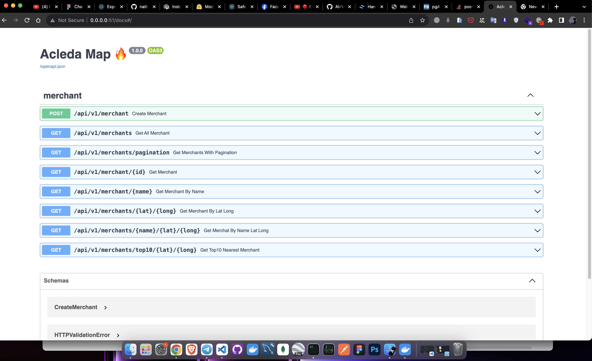

# Acleda Digital Map
> Digital map for future digital banking


# **Interactive API documentation**





### Project Overview

Project Overview:

This project aims to create a Location-based Partner Network platform with the following key features:

1. Location-based Partner Network: The platform will display ACLEDA's partners and merchants on a map, making it convenient for customers to locate nearby transaction points. Additionally, it will integrate partner data to showcase real-time promotions and offers.

2. Customizable Branding: Banks and financial institutions will have the ability to personalize the platform by adding their logos, colors, and branding elements to the map. This customization will provide a tailored experience to their customers.

3. Transaction History Visualization: Customers will be able to visualize their transaction history on the map, gaining insights into their spending patterns and financial behaviors.

4. Financial Services Hotspots: The platform will identify areas with high demand for financial services based on factors such as population density and customer demographics. This information will assist banks in identifying potential locations for new branches, ATMs, and self-service kiosks.

In summary, this project aims to develop a versatile platform that enhances customer experience by facilitating the discovery of transaction locations, offers branding customization options for financial institutions, provides insights into transaction history, and assists in strategic expansion based on demand analytics.

We utilize Node Package Manager (NPM) as a central tool to streamline project actions, making it easier to develop, test, and maintain two interconnected components: an API and a web UI.

### Project Components:

- API Component: This component is responsible for providing the back-end functionality of the application. It includes server-side logic, database interactions, and API endpoints. By housing it within the Monoripo monorepo, developers can work on it independently, allowing for modular development and testing.

- Web UI Component: The web UI component represents the user-facing part of the application. It includes all the front-end code, such as HTML, CSS, JavaScript, and any necessary client-side libraries or frameworks. Just like the API component, it is housed within the monorepo, enabling developers to manage the front-end and back-end codebase together seamlessly.

### Installation Guide
### To use the Monoripo, you need to install Node.js and Docker with Docker Compose.
Once you have installed the above and have cloned the repository, you can follow the following steps to get the project up and running:
1. Run `npm run build` to build docker image for merchant-api
2. Run `npm run start` then it will start all project in packages folder 

## How to start the app without Docker 
```
python -m venv env
source venv/bin/activate # for mac & linux & window(Gitbash)
venv\Script\activate     # for window(CMD)
cd packages\merchant-api
pip install -r .\requirements.txt
python main.py     #start server
visit   0.0.0.0:51/docs or 127.0.0.1:51/docs or localhost:8000/docs
```

### Merchant-Api Features


* SQLAlchemy 2.0+ support
* Programming Language: Python = 3.10
* Backend Framwork: FastAPI
* Database: Postgres
* ORM: Sqlalchemy2.0 & Alembic
* Data Validation & Serialization: Pydantic
* Authentication: JWT
* Unit Test: Pytest
* API Docs: Swagger UI

The project is designed to be modular and scalable. There are 3 main directories in the project:

1. `core`: This directory contains the central part of this project. It contains most of the boiler plate code like security dependencies, database connections, configuration, middlewares etc. It also contains the base classes for the models, repositories, and controllers. The `core` directory is designed to be as minimal as possible and usually requires minimal attention. Overall, the `core` directory is designed to be as generic as possible and can be used in any project. 

2.  The directory contains the actual application code. It contains the models, repositories, controllers, and schemas for the application. This is the directory you will be spending most of your time in while building features. The directory has following sub-directories:

   - `models` Here is where you add new tables
   - `repositories` For each model, you need to create a repository. This is where you add the CRUD operations for the model.
   - `schemas` This is where you add the schemas for the application. The schemas are used for validation and serialization/deserialization of the data.

3. `api`: This directory contains the API layer of the application. It contains the API router, it is where you add the API endpoints.


#### Schemas

The schemas are located in `app/schemas`. The schemas are used to validate the request body and response body. The schemas are also used to generate the OpenAPI documentation. The schemas are inherited from `BaseModel` from `pydantic`. The schemas are primarily isolated into `requests` and `responses` which are pretty self explainatory.


#### Testing

The project contains tests for all endpoints, some of the logical components like `JWTHander` and `AccessControl` and an example of testing complex inner components like `BaseRepository`. The tests are located in `tests/`. You can run the tests using `make test`.
